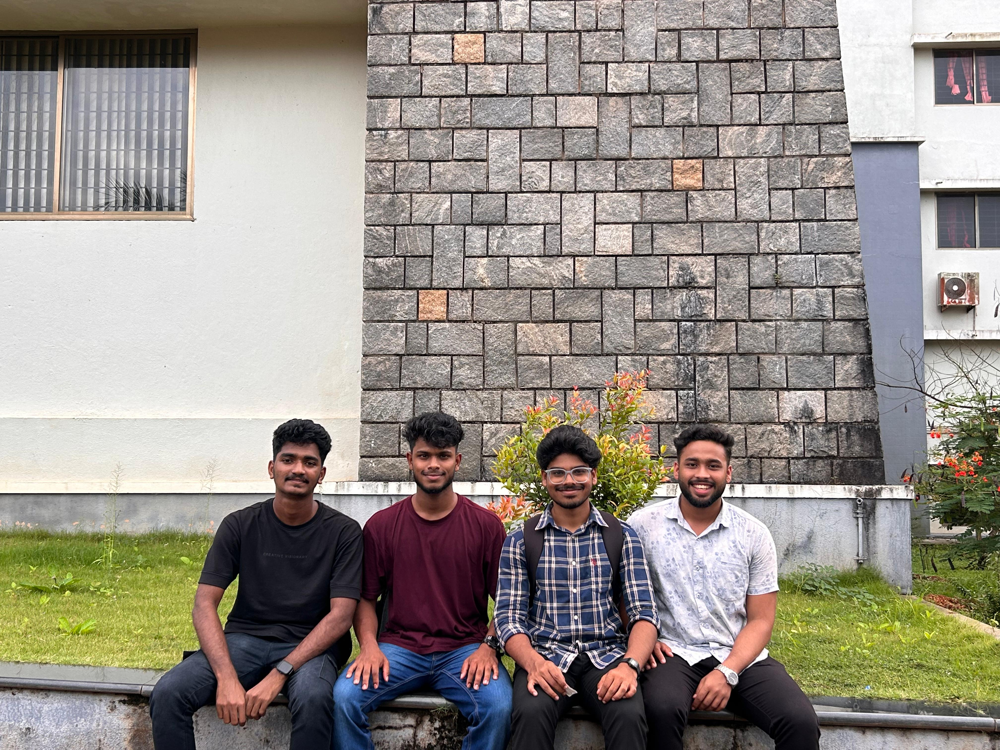

# AgentFlow 🚀

Welcome to **AgentFlow**, an advanced, interactive n8n-style workflow builder and orchestrator built with Next.js, React, and Zustand. It allows developers and teams to design, connect, and execute visual pipelines with drag-and-drop ease.

## 👥 Meet the Team

Below is the team behind the development of AgentFlow:



---

## 🌟 Key Features

### 1. Interactive Workflow Canvas
* **Drag-and-Drop Editor:** Place, configure, and connect nodes in real time.
* **Canvas Operations:** Full zoom, pan, and interactive grid background.
* **Bezier Curve Connections:** Visual connections styled similar to n8n with input/output validation.
* **Keyboard Shortcuts:** Quick options for duplication (`Ctrl + D`), deletion (`Delete`), and selection cancellation (`Escape`).

### 2. Rich Node Library (15+ Node Types)
* **Triggers:** Webhooks, Schedules.
* **Actions:** HTTP Requests, Email Senders.
* **Logic:** IF Conditions, Data Transformation.
* **Integrations:** Jira, Slack, Gmail, Notion, Airtable.
* **Project Management:** Trello, Asana, Monday.com, Jira PM.

### 3. Comprehensive Project Management Module
* **Kanban Board:** A drag-and-drop kanban board for moving tasks between statuses.
* **Task List View:** Sortable and filterable table view for bulk actions.
* **Analytics Dashboard:** Graphical visualization of completion rates, team productivity, and milestones.

---

## 🛠️ Technology Stack

* **Frontend Framework:** Next.js 15 (React 19)
* **State Management:** Zustand
* **Styling:** Tailwind CSS, Framer Motion (for smooth micro-animations)
* **Icons:** Lucide React
* **Package Manager:** npm / pnpm / yarn

---

## 🚀 Getting Started

### 1. Clone the repository
```bash
git clone https://github.com/Gaganhyphen3/AgentFlow1.git
cd AgentFlow1
```

### 2. Install dependencies
```bash
npm install
# or
pnpm install
```

### 3. Run the development server
```bash
npm run dev
# or
pnpm dev
```

Open [http://localhost:3000](http://localhost:3000) with your browser to see the application in action!

---

## 📁 Repository Structure

* `/app` - Next.js page routers & API endpoints
* `/components` - Modular canvas components, Kanban boards, and layout parts
* `/lib` - Application stores (Zustand), utility helper functions, and types
* `/public` - Static assets and documentation images
* `/styles` - Global style utilities and Tailwind setup
